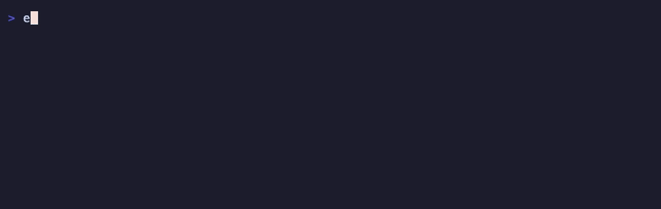

# promptpit

Portable AI agent stacks. Collect, install, and share across Claude Code, Cursor, and more.



## The Problem

Every AI coding tool has its own config format. Real-world stacks like [gstack](https://github.com/garrytan/gstack) require manual `git clone`, editing CLAUDE.md by hand, and running setup scripts — and only work in one tool. There's no `npm install` for AI agent configurations.

## The Solution

```bash
# Install someone's AI stack in one command
npx promptpit install github:garrytan/gstack
```

pit bundles skills, agent instructions, MCP server configs, and environment variables into a portable `.promptpit/` stack that works across AI tools.

## Install

```bash
npm install -g promptpit
```

Or use directly with `npx promptpit <command>`.

## Commands

### `pit collect`

Scans your project's AI tool configs and bundles them into a `.promptpit/` stack.

```bash
pit collect                    # collect from current directory
pit collect ./my-project       # collect from specific directory
pit collect --output ./bundle  # custom output path (default: .promptpit)
pit collect --dry-run          # show what secrets would be stripped
```

Output:

```
.promptpit/
├── stack.json          # Manifest (name, version, skills, compatibility)
├── agent.promptpit.md  # Agent instructions (from CLAUDE.md, .cursorrules)
├── skills/             # SKILL.md files
├── mcp.json            # MCP server configs (secrets auto-stripped)
└── .env.example        # Required environment variables
```

### `pit install`

Installs a stack into your project for all detected AI tools.

```bash
pit install .promptpit                    # from local bundle
pit install github:user/repo             # from GitHub (auto-collects if no .promptpit/)
pit install github:user/repo@v2.0        # specific tag/branch
pit install github:user/repo --global    # install to ~/.claude/, ~/.cursor/ (all projects)
pit install .promptpit --dry-run         # preview without writing
```

## Supported Tools

| Tool | Read | Write | Format |
|------|------|-------|--------|
| Claude Code | CLAUDE.md, .claude/skills/, .claude/settings.json | Native SKILL.md | skill.md |
| Cursor | .cursorrules, .cursor/rules/, .cursor/mcp.json | Auto-converted .mdc | mdc |

Adding a new tool requires one file + one registry entry. See `src/adapters/` for examples.

## How It Works

**Collect:** Detects which AI tools are configured in your project, reads their configs, merges them into a unified stack, strips secrets from MCP configs, and writes a `.promptpit/` bundle.

**Install:** Reads a stack bundle, detects which AI tools are present in the target project, and writes config in each tool's native format. SKILL.md files are auto-converted to .mdc for Cursor. Content is wrapped in idempotent markers so multiple stacks coexist and re-installs replace cleanly.

## Security

- **Secret stripping:** MCP config values matching known patterns (API keys, connection strings, tokens) are replaced with `${PLACEHOLDER}` during collect. `.env.example` is auto-generated.
- **Safe YAML parsing:** All frontmatter is parsed with `js-yaml` JSON_SCHEMA to prevent `!!js/function` code execution from untrusted sources.
- **Env name validation:** Dangerous env var names (`PATH`, `NODE_OPTIONS`, `LD_PRELOAD`) are blocked during install to prevent injection.
- **MCP trust warnings:** Installing MCP servers shows a warning since they run as executables.
- **Input sanitization:** GitHub owner/repo/ref are validated against a strict character allowlist.

## Development

```bash
git clone <repo-url>
cd promptpit
npm install
npm test          # 71 tests, vitest
npm run build     # builds dist/cli.js via tsup
npm run lint      # TypeScript strict mode check
```

## License

MIT
